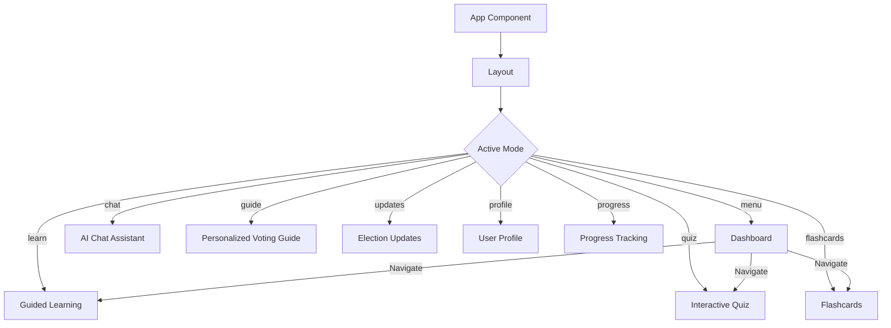
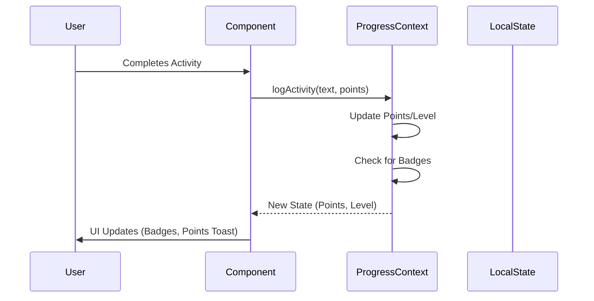

# 🗳️ VoteSmart: Indian Civic Education Platform

[](https://reactjs.org/)
[](https://vitejs.dev/)
[](https://developer.mozilla.org/en-US/docs/Web/CSS)
[](https://www.framer.com/motion/)

VoteSmart is a state-of-the-art interactive platform designed to empower Indian citizens with knowledge about their electoral system. Through a blend of guided learning, AI assistance, and gamified assessments, VoteSmart makes civic education engaging, accessible, and personalized.

---

## 🏛️ Project Overview

VoteSmart addresses the gap in civic literacy by providing a comprehensive toolkit for voters:
- **Educational Path**: Structured modules from voter registration to understanding the parliament.
- **Smart Assistance**: An AI-powered chat assistant to answer complex electoral questions.
- **Progressive Learning**: Gamified elements like points, levels, and badges to keep users engaged.
- **Localized Context**: Specifically tailored for the Indian democratic framework.

---

## 🗺️ Application Architecture

### 🔄 Navigation & Component Flow

The application uses a centralized state management system to navigate between specialized modules while maintaining a consistent layout.



### 🧠 State & Data Flow (ProgressProvider)

User progress, points, and achievements are managed through a global React Context API.



---

## ✨ Key Features

### 📖 Guided Learning Path
Interactive modules that break down complex civic topics into digestible "cards".
- **Module Types**: Registration Basics, Electoral Timeline, Understanding Candidates.
- **Interactive Checkpoints**: Short questions interleaved with content.

### 🤖 AI Civic Assistant
A specialized chat interface that leverages AI to provide instant answers to user queries about voting rights, locations, and procedures.

### 🏆 Gamified Assessment
- **Quizzes**: Test your knowledge with time-bound or category-specific quizzes.
- **Flashcards**: Quick-fire learning for essential civic terms and concepts.
- **Badges & Streaks**: Earn rewards for consistent learning and high scores.

### 📋 Personalized Voting Guide
A dynamic checklist that helps users prepare for election day:
- Check registration status.
- Locate polling stations.
- Identify required documents (EPIC, Aadhaar, etc.).

---

## 🛠️ Tech Stack

- **Frontend**: React 18+ with Vite for lightning-fast HMR.
- **Styling**: Vanilla CSS with modern Flexbox/Grid layouts and responsive design.
- **Animations**: Framer Motion for smooth transitions and interactive micro-animations.
- **Icons**: Lucide React for consistent and accessible iconography.
- **State Management**: React Context API with custom hooks for modular logic.
- **Containerization**: Docker support for consistent development and deployment environments.

---

## 🚀 Getting Started

### Prerequisites
- Node.js (v18.0 or higher)
- npm or yarn

### Installation

1. **Clone the repository**
   ```bash
   git clone https://github.com/RockHit921/VoteSmart.git
   cd VoteSmart
   ```

2. **Install dependencies**
   ```bash
   npm install
   ```

3. **Start the development server**
   ```bash
   npm run dev
   ```

4. **Build for production**
   ```bash
   npm run build
   ```

### Running with Docker

```bash
docker build -t votesmart .
docker run -p 3000:3000 votesmart
```

---

## 🤝 Contributing

Contributions are welcome! Please feel free to submit a Pull Request.

1. Fork the Project
2. Create your Feature Branch (`git checkout -b feature/AmazingFeature`)
3. Commit your Changes (`git commit -m 'Add some AmazingFeature'`)
4. Push to the Branch (`git checkout origin feature/AmazingFeature`)
5. Open a Pull Request

---

## 📄 License

Distributed under the MIT License. See `LICENSE` for more information.

---

*Made with ❤️ for the Indian Electorate*
